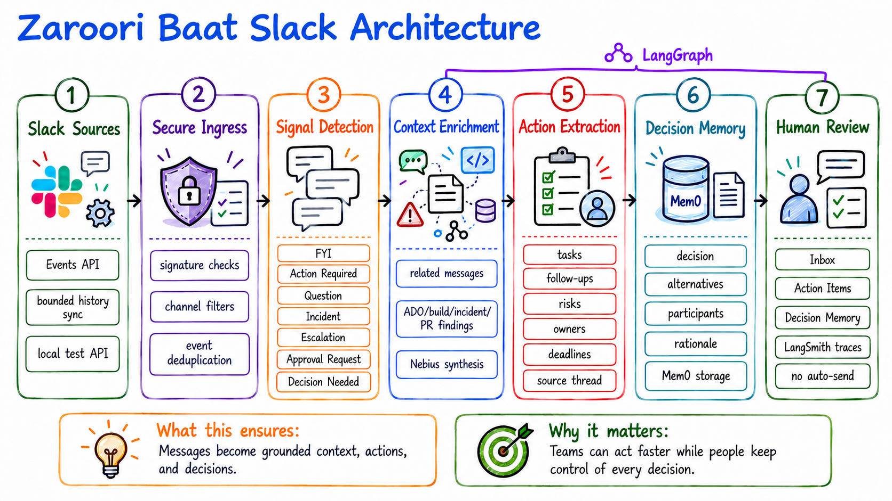

# Zaroori Bath Slack Intelligence — Design Document

**Status:** Implemented baseline / production-hardening roadmap  
**Version:** 1.0  
**Date:** 2026-09-12  
**Repository:** `shkyanam/zaroori-baat-slack`

## 1. Purpose

Zaroori Bath turns Slack messages into a reviewable work queue. It identifies messages that need attention, gathers context from related Slack conversations and connected sources, extracts actions and decisions, and presents the result to a human reviewer.

The system is designed for a key operating principle:

> AI adds context and prepares work; a person remains in control of decisions and actions.

## 2. Goals

- Detect and classify incoming Slack messages quickly.
- Preserve context spread across multiple messages and threads.
- Enrich messages with related work, build, incident, PR, and discussion evidence.
- Extract tasks, follow-ups, risks, and decisions with owners, dates, and source messages where available.
- Store organizational decisions so they can be searched later.
- Keep Slack ingestion responsive by acknowledging first and enriching in the background.
- Make every workflow run observable and safe to inspect.
- Degrade gracefully to deterministic local processing when external services are disabled or unavailable.

## 3. Non-goals

- Scraping the Slack user interface.
- Reading channels the Slack app cannot access.
- Sending replies, approving changes, or executing actions automatically.
- Treating generated text as authoritative evidence without human review.
- Replacing ADO, build, incident, PR, or Slack systems of record.

## 4. High-level architecture



```text
Slack Events API / Slack history sync / local test API
                         |
                  secure ingress + deduplication
                         |
                immediate Inbox persistence
                         |
       LangGraph: classify -> related messages -> context enrichment
                                      |                    |
                             action extraction      decision memory
                                      \                    /
                                      persist -> router
                         |
       SQLite audit store + optional local RAG embeddings + optional Mem0
                         |
              React review workspace + LangSmith traces
```

### Component responsibilities

| Component | Responsibility | Current implementation |
| --- | --- | --- |
| Slack adapter | Receive events and read configured channel history | `POST /webhooks/slack`, `POST /api/slack/sync` |
| Secure ingress | Verify Slack signatures, filter event types, deduplicate external IDs | `app.py` |
| Signal Detection | Assign classification, priority, score, reason, and suggested action | Deterministic rules in `prioritize_message()` |
| Related-message retrieval | Find same-thread, shared-reference, lexical, and optional semantic matches | SQLite matching plus optional embeddings |
| Context Enrichment Agent | Combine Slack evidence with mocked ADO/build/incident/PR/discussion findings | Deterministic context builder plus optional Nebius synthesis |
| Action Extraction Agent | Extract tasks, follow-ups, risks, and decisions from multiple messages | Deterministic fallback plus optional Nebius JSON extraction |
| Decision Memory Agent | Capture decision, alternatives, participants, date, rationale, and sources | Local SQLite plus optional Mem0 sync/search |
| Persistence | Store message output and workflow telemetry idempotently | SQLite tables `messages` and `workflow_runs` |
| Router | Determine human-review state and safe action path | No automatic send or approval |
| Review workspace | Present inbox, context, actions, memory, system status, and observability | React/Vite frontend |

## 5. Message classification and priority

Every message currently receives one classification. The six requested operational classifications are:

- Action Required
- Question
- Incident
- Escalation
- Approval Request
- Decision Needed

The implementation also retains **FYI** as a neutral catch-all for informational or social messages. The UI exposes a tab for every implemented classification. If the product must show exactly six tabs, FYI can be hidden from navigation while remaining an API/storage value for low-priority messages.

Classification precedence prevents ambiguous messages from moving between tabs unpredictably:

```text
Approval Request -> Escalation -> Incident -> Decision Needed
                 -> Question -> Action Required -> FYI
```

Priority is independent of classification:

- **High:** urgency, blocker, incident, production issue, or near-term deadline.
- **Medium:** actionable request without immediate urgency.
- **Low:** informational or social content.

The API exposes `classification`, `priority`, `score`, `reason`, and `suggested_action` as separate fields.

## 6. End-to-end processing flow

### 6.1 Ingestion

1. Slack sends a `message` or `app_mention` event to `/webhooks/slack`.
2. The endpoint handles Slack URL verification and validates `X-Slack-Signature` when `SLACK_SIGNING_SECRET` is configured.
3. Empty messages, unsupported subtypes, and messages outside configured channels are ignored.
4. `external_id` is checked for idempotency.
5. A lightweight row is inserted into the Inbox with deterministic classification and a queued status.
6. The endpoint returns success immediately; background processing continues in the workflow executor.

History sync uses `SLACK_BOT_TOKEN` and `SLACK_CHANNEL_IDS`, fetches the configured recent-message window, and applies the same workflow. A local `POST /api/messages` path supports testing without Slack.

### 6.2 LangGraph workflow

The graph is compiled once and reused for webhook, sync, local test, and evaluation paths.

```text
START
  -> classify
  -> related_messages
  -> context_enrichment
      -> action_extraction
      -> decision_memory
  -> persist
  -> router
  -> END
```

The graph state is serializable and includes message identity, sender, channel, thread, text, classification result, related messages, context, extracted actions, decision memory, routing result, and test metadata.

### 6.3 Context enrichment

The agent receives:

- The current Slack message.
- Related messages from the same thread or local history.
- Optional semantic matches from the local RAG index.
- Mocked findings representing ADO, build history, incident systems, related PRs, and previous discussions.

The deterministic builder produces a briefing, source list, latest update, incident status, related work item, related PRs, previous discussion, and suggested response. When Nebius is enabled, the LLM synthesizes only the supplied evidence and must return validated JSON. Missing evidence is reported as missing rather than invented.

Example output:

```text
The report rollout task 63414893 appears related.
Latest update: The report was enabled.
No active incidents found.
Suggested response ready.
```

### 6.4 Action extraction

Action extraction combines the current message and related messages so a task can be reconstructed from a multi-message conversation.

Supported item types:

| Type | Captured fields |
| --- | --- |
| Task | title, owner, due date, source message IDs, confidence |
| Follow-up | title, owner, due date, source message IDs, confidence |
| Risk | title, source message IDs, confidence |
| Decision | title, source message IDs, confidence |

The LLM is instructed not to invent owners, dates, risks, or decisions. If the LLM is unavailable, local extraction uses explicit language patterns and preserves unknown fields as null.

### 6.5 Decision memory

The Decision Memory Agent stores a decision only when the evidence indicates that a decision was made. Stored fields include:

- Decision / selected option
- Alternatives considered
- Participants
- Date
- Rationale
- Confidence
- Source message IDs and Slack source

SQLite is the local audit source. When `MEM0_ENABLED=true` and a Mem0 API key is configured, extracted decisions are written to Mem0 for semantic search. If Mem0 is unavailable, local SQLite search remains available. The integration is idempotent through the stored-memory marker, so workflow retries do not duplicate successful writes.

## 7. Retrieval and storage design

### 7.1 SQLite

SQLite is the default local persistence layer.

| Table | Purpose |
| --- | --- |
| `messages` | Source Slack message and derived classification, context, actions, decision memory, and review state |
| `workflow_runs` | Run status, duration, classification, agent providers, and errors |
| `message_embeddings` | Optional embedding vectors for local semantic retrieval |
| `slack_identity_cache` | Short-lived Slack user/channel display-name cache |
| `app_settings` | Local application settings |

JSON fields are used for evolving agent outputs while stable review fields remain top-level columns.

### 7.2 Hybrid local RAG

RAG is opt-in. When enabled:

1. A configured OpenAI-compatible embeddings endpoint creates a vector for each message.
2. The vector is stored in `message_embeddings` as JSON in SQLite.
3. Query-time retrieval combines deterministic lexical/thread matching with cosine similarity.
4. Results are capped by `RAG_TOP_K` and filtered by `RAG_MIN_SIMILARITY`.

RAG indexing is scheduled after persistence so it does not delay the default Slack fast path. No Pinecone dependency is required for the current implementation.

## 8. External integrations

### Slack

Required configuration for live ingestion:

```env
SLACK_BOT_TOKEN=...
SLACK_CHANNEL_IDS=C012...,C034...
SLACK_SIGNING_SECRET=...
```

The bot must be invited to each monitored private channel. Channel IDs are used rather than channel names.

### Nebius

Nebius Token Factory is accessed through an OpenAI-compatible chat-completions endpoint:

```env
NEBIUS_API_KEY=...
NEBIUS_MODEL=...
NEBIUS_CONTEXT_ENABLED=true
NEBIUS_BASE_URL=https://api.tokenfactory.nebius.com/v1
```

The current code uses low temperature, bounded tokens, JSON response mode, request timeouts, response validation, and deterministic fallback behavior.

### Mem0

```env
MEM0_ENABLED=true
MEM0_API_KEY=...
MEM0_BASE_URL=https://api.mem0.ai
MEM0_USER_ID=zaroori-baat-workspace
```

Mem0 is an enhancement to local decision memory, not the only source of truth.

### LangSmith

```env
LANGSMITH_TRACING=true
LANGSMITH_API_KEY=...
LANGSMITH_PROJECT=zaroori-baat-slack
LANGSMITH_CAPTURE_CONTENT=false
```

LangGraph runs, workflow nodes, Nebius calls, and Mem0 calls can be traced. With content capture disabled, traces retain safe structured summaries such as IDs, classifications, statuses, counts, and durations without storing raw Slack text.

## 9. API design

| Method | Endpoint | Purpose |
| --- | --- | --- |
| `GET` | `/health` | Basic service health and safe configuration status |
| `GET` | `/api/messages` | List stored messages for the review workspace |
| `POST` | `/api/messages` | Process a local test message |
| `GET` | `/api/messages/{id}` | Read one processed message |
| `POST` | `/api/messages/{id}/context` | Refresh context, actions, decision memory, and priority |
| `POST` | `/api/messages/{id}/decision` | Record `approved`, `dismissed`, `deferred`, `escalated`, or `pending` |
| `POST` | `/webhooks/slack` | Receive Slack Events API events |
| `POST` | `/api/slack/sync` | Sync configured Slack channel history |
| `GET` | `/api/system/status` | Show safe status for Slack, context, memory, workflow, and demo mode |
| `GET` | `/api/workflow/status` | Show LangGraph/checkpointer status |
| `GET` | `/api/observability/status` | Show safe LangSmith configuration |
| `GET` | `/api/observability/summary` | Show local run totals, duration, failures, and classification counts |
| `GET` | `/api/decision-memory/status` | Show local/Mem0 memory status |
| `GET` | `/api/decision-memory/search?q=...` | Search decision memory |
| `POST` | `/api/decision-memory/sync` | Backfill local decisions to Mem0 |
| `GET` | `/api/rag/status` | Show RAG configuration and indexing state |
| `POST` | `/api/rag/reindex` | Start a non-blocking local embedding reindex |

## 10. UI design

The React review workspace follows the **Understand → Prepare → Decide** journey:

- **Inbox:** classification tabs, priority sorting, message detail, context briefing, related messages, and suggested response.
- **Action items:** extracted tasks, follow-ups, risks, and decisions with owners, due dates, and source threads.
- **Decision memory:** searchable decisions, alternatives, participants, rationale, and Mem0/local provider state.
- **System & preferences:** Slack connection, context sources, memory, workflow/checkpointer, refresh controls, and display density.
- **Observability:** local workflow metrics, recent runs, classifications, durations, failures, and a link to LangSmith when active.

The UI supports review decisions but does not provide an auto-send path.

## 11. Security and privacy

- Verify Slack signatures before processing live events.
- Keep Slack, Nebius, Mem0, RAG, LangSmith, and PostgreSQL credentials in environment variables or a deployment secret manager.
- Never commit `.env` files, tokens, or database credentials.
- Default external LLM context synthesis to disabled until explicitly enabled.
- Default LangSmith content capture to disabled.
- Send only the evidence needed for the requested agent operation.
- Validate LLM JSON responses against an expected schema before persistence.
- Treat retrieved Slack text and tool findings as evidence, not instructions.
- Keep human review as the authorization boundary for decisions and actions.
- Expose configuration status without exposing secret values.

## 12. Reliability and operational behavior

- Webhook ingestion acknowledges quickly and processes enrichment asynchronously.
- External Slack event IDs prevent duplicate processing.
- Existing decisions and successful Mem0 markers are preserved during retries.
- Nebius, Mem0, and embeddings failures fall back to local behavior where possible.
- `SLACK_FAST_PATH=true` keeps live ingestion responsive; full enrichment can be requested with **Refresh context** or by disabling the fast path.
- SQLite is suitable for local development and single-instance usage.
- Production deployments should use the PostgreSQL LangGraph checkpointer and a production-grade deployment secret store.
- Current background executors are process-local; multi-instance production deployments need a shared queue/worker strategy before scaling horizontally.

## 13. Testing strategy

### Automated tests

- Backend unit/API tests cover classification, orchestration, RAG, evaluators, local-live behavior, and Slack identity handling.
- Frontend Playwright tests cover inbox grouping, hero layout, Slack identity rendering, shell behavior, and end-to-end review journeys.
- LangSmith evaluation scripts support deterministic evaluators and an optional LLM judge.

### Required acceptance scenarios

1. **Classification:** one message appears under the correct classification tab and preserves priority.
2. **Multi-message context:** a report question plus a rollout update produces related-message evidence and a grounded briefing.
3. **Action extraction:** “We need parity before Friday” and “Sneha can own the test plan” produce one task with owner Sneha, due date Friday, and source IDs from the thread.
4. **Decision memory:** a decision naming pattern A over pattern B stores the decision, alternative, participant, date, rationale, and source thread.
5. **Fallback:** disabling Nebius or Mem0 still produces deterministic classification and local results.
6. **Safety:** approval/incident/escalation/decision messages remain human-review items and never auto-send.
7. **Observability:** a completed run appears in local metrics and, when enabled, in LangSmith with safe trace metadata.
8. **Idempotency:** replaying the same Slack event does not create a duplicate message.

## 14. Deployment and configuration

### Local development

```bash
python3 -m venv .venv
source .venv/bin/activate
pip install -r requirements.txt
npm --prefix frontend ci
npm --prefix frontend run build
python3 app.py
```

The service defaults to `http://127.0.0.1:8001`. The frontend is built and served by the Python application.

### Production baseline

- Run behind TLS termination and an authenticated reverse proxy.
- Use `ZAROORI_BAAT_SLACK_HOST=0.0.0.0` only within the deployment network.
- Configure `LANGGRAPH_CHECKPOINTER=postgres` and `LANGGRAPH_POSTGRES_URI`.
- Store all API keys and signing secrets in a secret manager.
- Add structured logs, alerting, backup, and retention policies for SQLite/PostgreSQL and decision memory.
- Replace process-local executors with a durable queue before running multiple application instances.

## 15. Open items for production hardening

- Replace mocked ADO, build, incident, PR, and previous-discussion providers with authenticated connectors.
- Add application authentication and role-based access for the review workspace.
- Define data retention, deletion, export, and tenant-isolation policies.
- Add durable background workers and retry/dead-letter handling.
- Add rate limits and circuit breakers for external providers.
- Add migration tooling for PostgreSQL application data if the SQLite store must move beyond local use.
- Decide whether FYI remains a visible seventh tab or is hidden as an internal catch-all.
- Add provider-specific embedding configuration and cost/latency budgets.

## 16. Implementation map

| Area | Files |
| --- | --- |
| Python API, workflow, persistence, integrations | `app.py` |
| LangSmith evaluation adapter | `orchestrator.py`, `evaluators.py`, `run_langsmith_eval.py` |
| React workspace | `frontend/src/App.tsx`, `frontend/src/pages/`, `frontend/src/components/` |
| API contract | `API_ENDPOINTS.md` |
| Local setup and operating instructions | `README.md`, `LOCAL_DEVELOPMENT.md` |
| Backend tests | `tests/backend/` |
| Browser tests | `frontend/tests/` |

