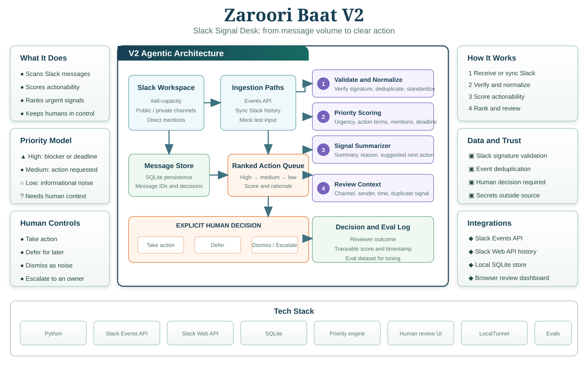

# Zaroori Baat V2

## Slack Signal Desk

Zaroori Baat V2 scans incoming Slack message events, scores actionability, and ranks the messages most likely to need a response, owner, or decision.



### Run locally

```bash
cd ZAROORI_BAAT_V2
python3 app.py
```

Open http://127.0.0.1:8001.

### Slack app setup

Create a Slack app at api.slack.com/apps and enable **Event Subscriptions**. Set the Request URL to:

```text
https://YOUR_PUBLIC_HOST/webhooks/slack
```

Subscribe to bot events such as `message.channels`, `message.groups`, or `message.im` according to the channels the bot is allowed to access. Set `SLACK_SIGNING_SECRET` in the environment before production use. The endpoint supports Slack URL verification and verifies signed requests when the secret is configured. Set `SLACK_CHANNEL_IDS` to a comma-separated list to scan multiple channels with one Sync Slack action.

### Design boundary

This MVP processes events delivered to the Slack app. It does not scrape Slack's UI or pull private history without the required Slack scopes. The queue is connector-independent, so mock messages can be used for evaluation.

### Priority model

- **High:** blocker, incident, deadline, urgent request, or explicit action with a near-term time.
- **Medium:** actionable request without an immediate deadline.
- **Low:** informational or social message without a clear action.

Human actions are recorded as `approved`, `deferred`, `dismissed`, or `escalated`.
